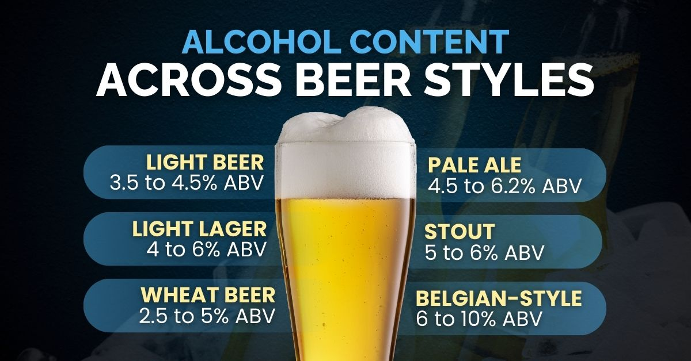

Documentation for EMA-BEERs on 17.04.2026. For questions contact [Marco](mailto:mcsr@dtu.dk) or [Yannick](mailto:yahei@dtu.dk).

For more details on all topics, please visit the "life-changing" [MLOps course](https://skaftenicki.github.io/dtu_mlops/latest/). Credits to [Nicki Skafte](https://skaftenicki.github.io/).

Picture taken from [here](https://nationaltasc.org/how-much-alcohol-is-in-beer/).