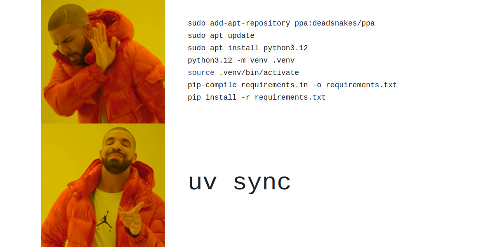

# Package Management with uv

Every Python project needs a way to manage its dependencies: the external libraries your code relies on. This page introduces **uv**, the tool we use in this course, explains the concept of virtual environments, and briefly covers how it compares to tools you may already know.

## The Problem uv Solves

When you work on multiple Python projects, they will often require different versions of the same library. Project A might need `pandas 1.5`, while Project B needs `pandas 2.1`. If you install everything globally with `pip`, these versions clash and eventually break each other.

The standard solution is to give each project its own isolated Python environment with its own set of packages. **uv** is a modern tool that handles this cleanly and very quickly. It manages your Python version, your virtual environment, and your dependencies all in one place.

uv is written in Rust, which makes it substantially faster than older tools like pip or conda for installing packages.



## uv vs pip and Conda

You have likely used **pip** and possibly **Conda** (or Miniconda) before. All three tools solve the same core problem — managing dependencies — but they take different approaches.

| Feature | uv | pip | Conda |
|---------|----|-----|-------|
| Focus | Python-only | Python-only | Multi-language |
| Speed | Extremely fast | Slow | Slower |
| Env location | `.venv/` (project-local) | anywhere | `~/miniconda3/envs/` |
| Config file | `pyproject.toml` | `requirements.txt` | `environment.yml` |
| Manages Python version | Yes | No | Yes |
| Best for | Python projects | Simple scripts | Scientific stacks |

The key practical difference from Conda is where the environment lives. With Conda, all environments are stored in a single central directory on your machine, separate from your project. With uv, the environment sits directly inside your project folder in a folder called `.venv`. This makes it obvious what belongs to what, and it travels with your project.

When you create a project with uv, it creates a `.venv` folder inside your project directory:

```
my-project/
    .venv/                   <- the virtual environment lives here
        bin/
            python
            pip
            activate
        lib/
            python3.12/
                site-packages/   <- installed packages go here
    src/
    pyproject.toml
```

The Python executable inside `.venv/bin/python` is the one your project uses. Your installed packages go into `.venv/lib/`. Nothing touches the system Python or any other project.

Because `.venv` is just a folder inside your project, you always know exactly where it is. If something goes wrong, you can delete it and recreate it in seconds with `uv sync`.

!!! note
    `.venv` should be added to your `.gitignore`. You never commit the environment itself to Git, only the `pyproject.toml` that describes it. Anyone who clones your repo can recreate the exact environment by running `uv sync`.

## Core uv Commands

### uv init

`uv init` creates a new project folder with the standard structure and files.

```bash
uv init my-project
cd my-project
```

This creates:

```
my-project/
    .python-version     <- pins the Python version
    pyproject.toml      <- project metadata and dependencies
    README.md
    src/
        my_project/
            __init__.py
```

uv also creates a `.venv` folder and installs the base Python version automatically. You are ready to start adding packages immediately.

If you want to initialise uv inside an existing folder instead of creating a new one:

```bash
cd existing-folder
uv init
```

### uv add

`uv add` installs a package into your project and records it in `pyproject.toml`. Think of it as `pip install`, but it also keeps your config file up to date automatically.

```bash
uv add requests
uv add pandas numpy
uv add pytest --dev
```

The `--dev` flag marks a package as a development dependency: something needed for testing or tooling but not for running the project in production (e.g., pytest, ruff).

After running `uv add`, two things happen: the package is installed into `.venv`, and `pyproject.toml` is updated to record the new dependency. You should commit `pyproject.toml` to Git so others can reproduce your environment.

### uv sync

`uv sync` reads `pyproject.toml` and installs all the listed dependencies into `.venv`. It is the command you run after cloning a project to get the environment set up — the uv equivalent of `pip install -r requirements.txt`.

```bash
uv sync
```

If `.venv` does not exist yet, uv creates it. If packages are already installed but out of date with `pyproject.toml`, uv updates them. If a package is installed but no longer listed in `pyproject.toml`, uv removes it.

This makes `uv sync` the single source of truth: what is in `pyproject.toml` is exactly what ends up in `.venv`.

### uv run

Instead of activating the virtual environment manually, you can prefix any command with `uv run` to execute it inside the project environment:

```bash
uv run python my_script.py
uv run pytest tests/
uv run ruff check .
```

This works from anywhere inside the project directory without needing to activate `.venv` first.

## The pyproject.toml File

`pyproject.toml` is the central configuration file for your project. It replaces the older `requirements.txt` and `setup.py` approaches and is the current standard for Python projects.

A typical file looks like this:

```toml
[project]
name = "my-project"
version = "0.1.0"
description = "A short description of the project"
requires-python = ">=3.11"

dependencies = [
    "pandas>=2.0",
    "requests>=2.28",
]

[build-system]
requires = ["hatchling"]
build-backend = "hatchling.build"
```

The `dependencies` list is what `uv add` writes to when you install a package. The `requires-python` field pins the minimum Python version.

You can also configure tools like Ruff directly in `pyproject.toml`:

```toml
[tool.ruff]
line-length = 120
```

This keeps all project configuration in a single file rather than scattered across `.flake8`, `setup.cfg`, and other tool-specific files.

## Activating the Virtual Environment

If you need to activate the environment in your shell (e.g., for an IDE or interactive use), you can do so as you would with any standard virtual environment:

```bash
# Linux / macOS
source .venv/bin/activate

# Windows
.venv\Scripts\activate
```

Once activated, `python` and installed commands resolve to the ones inside `.venv`. Deactivate with:

```bash
deactivate
```

For running scripts and tools, prefer `uv run` over activating manually — it is less error-prone and works consistently across platforms.
